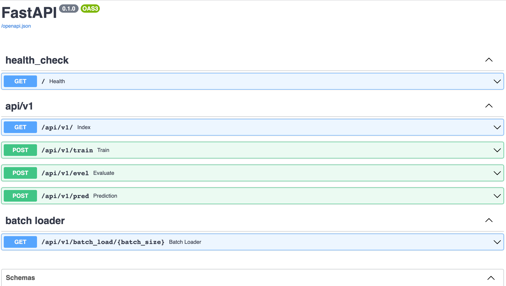

# TFpackageText

<details open="open">
<summary>Table of Contents</summary>

- [Prerequisites](#Prerequisites)
- [Structure](#Structure)
- [Getting Started](#Getting-Started)
  - [Installation](#Installation)
  - [Usage](#Usage)
  - [Model Training evaluating prediction](#Model-Training-evaluating-prediction)
  - [Rewrite pretrained model interface](#Rewrite-pretrained-model-interface)
  - [API calls](#API-calls)
  - [Swagger docs](#Swagger-docs)
  - [Data Pipeline](#Data-Pipeline)
  - [Tensorflow serving](#Tensorflow-serving)
  - [Project Automation](#Project-Automation)
  - [Examples](#Examples)
  - [Simple pressure test](#simple-pressure-test)
- [Contributing](#Contributing)
- [License](#License)
</details>

---

## Prerequisites
* python >= 3.7
* tensorflow == 1.15
* fastapi == 0.75.2

## Structure
```
.
├── Dockerfile                              # API service on containers
├── Jenkinsfile                             # Jenkins file used for automation
├── README.md
├── requirements.txt                        # required libraries
├── startup_api.sh                          # start API service
├── ..........
└── textMG                                  # source directory
    ├── APIs                                # API codes
    │   └── routers                         # fastAPI routers
    │       ├── data_generator.py
    │       ├── health_check.py
    │       ├── tensorflow_service.py       # contains all training/eval/pred/refer APIs 
    │       ├── users.py                    # contains user management APIs
    │       └── .....
    ├── configs                             # args config files
    │   ├── config.py
    │   └── config_multiGPU.py
    ├── datasets                            # for tools used for data loading&processing
    │   ├── data_loader.py                  
    │   ├── dataset.py                      # tools for data manipulating
    │   └── generator.py                    # generator for data batch 
    ├── embeddings                          # word2vec model embeddings 
    ├── logs                                # logs file
    ├── models                              # deep learning models
    ├── test                                # testing for each components
    ├── tf_serving                          # tensorflow serving grpc and restful
    ├── utils                               # utils tools
    ├── main_multiGPU.py                    # main entrypoint for model training/eval/pred
    ├── api_run.py                          # main entrypoint for API services 
    ├── startup.sh                          # another entrypoint for model training/eval/pred
    └── ..........
```

## Getting Started

### Installation
```
$ pip install -r requirements.txt
```
or use it as a library
```
python setup.py sdist
pip install TFpackageText-0.0.1.tar.gz
```

### Usage
```
from textMG import models, datasets, APIs
```

### Model Training evaluating prediction
It is initially trained on multi-GPU environment
```
$ ./starup.sh -m [train|evel|pred]
```
or via APIs:
```
http://localhost:5000/api/v1/models/train
http://localhost:5000/api/v1/models/eval
http://localhost:5000/api/v1/models/pred
http://localhost:5000/api/v1/models/infer
http://localhost:5000/api/v1/models/pro_cons_infer
```

### Rewrite pretrained model interface
original source code is trained via tf.estimater which is hard to debug and 
manipulate transformer models. The new interface will be able to run
purely with session.
```
class Bert_module:
    def __init__(self, *args, **kwargs):
        self.bert = BertModel
        self.kwargs = kwargs

    def __call__(self, num_labels, max_len, hidden_size, reuse=tf.AUTO_REUSE, is_training=True, dropout=0.3, *args, **kwargs):
        with tf.variable_scope('bert_classification', reuse=reuse):
            output_weights = tf.get_variable(
                "output_weights", [num_labels, hidden_size],
                initializer=tf.truncated_normal_initializer(stddev=0.02))
```
set 'is_pretrained' to be True in order to use pretrained model as embeddings
```parser.add_argument('--is_pretrained', type=bool, default=True)```

### API calls
Start API
```
$ python api_run.py
```


or start API in a container
```
$ docker build -t api_docker .
$ docker run -t -p 80:5000 -v /home/projects/TFpackageText/textMG:/home/projects --name=api_docker_service api_docker
```
or run api on production
```
$ gunicorn api_run:app --workers 2 --worker-class uvicorn.workers.UvicornWorker --bind 0.0.0.0:5000 --log-level debug
```

### Swagger docs
```
http://localhost:5000/docs
```
### Data Pipeline
data can be loaded directly
```
# load data from disk and generator.
generator = Generator()
iter = generator.get_next_patch(batch=2)
el = next(iter)
```
or via tf.data.Dataset.from_generator
```
train_dataset = tf.data.Dataset.from_generator(generator.get_next_patch,
                                               output_types={generator.input: tf.float32,
                                                             generator.output: tf.float32})
train_dataset = train_dataset.repeat().batch(args.batch_size * args.num_gpusORcpus).prefetch(1)
```
or via api
```
curl -X 'GET' \
  'http://localhost:5000/api/models/batch_load/2' \
  -H 'accept: application/json'
```
### Tensorflow serving
after training, the model for tf servering is saved to different path for restful and grpc.
```
# call build_SavedModel to build a SavedModel for tensor serving
build_SavedModel(conv_net, args.export_path_serving, args.savedmodel_version, X_batch_numGPU, best_sess)
```

```
$ docker pull tensorflow-serving:1.15.0
$ nohup docker run --name container_serving -p 8501:8501 -p 8500:8500 \
    ........
    --batching_parameters_file=/models/batch.config >  /home/projects/tf1_serving_log.out 2>&1 &
```
call api for reference via tfserving
```
curl -X 'POST' \
  'http://localhost:5000/api/v1/models/infer' \
  -H 'accept: application/json' \
  -H 'Content-Type: application/json' \
  -d '{
  "batch_infer": [
    "string"
  ]
}'
```
or call reference api  in producer/consumer model
```
curl -X 'POST' \
  'http://localhost:5000/api/v1/models/pro_cons_infer' \
  -H 'accept: application/json' \
  -H 'Content-Type: application/json' \
  -d '{
  "batch_infer": [
    "string"
  ]
}'
```

### Project Automation
edit Jenkinsfile to automate the process of training/evaluating/referring
```
node("jekins-agent1"){
    stage("Git clone"){
        sh 'cd /opt/jenkins/workspace/  && rm -rf TFpackegeText'
        sh 'git clone git@github.com:victorbai2/TFpackageText.git && tar -czvf package.tar.gz'
    }
    .......
```

### Examples
predict:
```
curl -X 'POST' \
  'http://localhost:5000/api/v1/models/pred' \
  -H 'accept: application/json' \
  -H 'Content-Type: application/json' \
  -d '{
  "inquiry": [
    "在北京举办...", "三点不足导致球队...."...
  ]
}'

Response Body:

{
  "data": {
    "records": {
      "0": {
        "category": "entertainment",
        "label": "1",
        "pred_logits": "[0.17890048027038574, 0.23429206013679504, 0.220640629529953, 0.17155364155769348, 0.1946132332086563]"
      },
      "1": {
        "category": "entertainment",
        "label": "1",
        "pred_logits": "[0.17201262712478638, 0.24676887691020966, 0.22940053045749664, 0.15629342198371887, 0.19552461802959442]"
      }
    },
    "time_used": "0.519162654876709"
  },
  "code": 200,
  "message": "success",
  "error": false
}
```
load data batch(batch_size=2):
```
curl -X 'GET' \
  'http://localhost:5000/api/v1/models/batch_load/2' \
  -H 'accept: application/json'
  
Response Body:
{
  "data": {
    "batch": {
      "x_input": [
        [701,101,..],
        [1842,2182,...]
      ],
      "y_output": [
        [0,0,0,0,1],
        [0,0,0,0,1],
      ]
    },
    "input_shape": [2,30],
    "output_shape": 2
  },
  "code": 200,
  "message": "success",
  "error": false
}
```

### Simple pressure test
```
$ ab -p tensorAPI.json  -T 'application/json' -H 'Content-Type: application/json'  -c 500 -n 500 http://localhost:5000/api/v1/models/infer
```
```
$ ab -p tensorAPI.json  -T 'application/json' -H 'Content-Type: application/json'  -c 500 -n 500 http://localhost:5000/api/v1/models/pro_cons_infer
```

## Contributing
Pull requests are welcome. For major changes, please open an issue first to discuss what you would like to change.

Please make sure to update tests as appropriate.

## License
[VB](https://VB.com/licenses.cn)